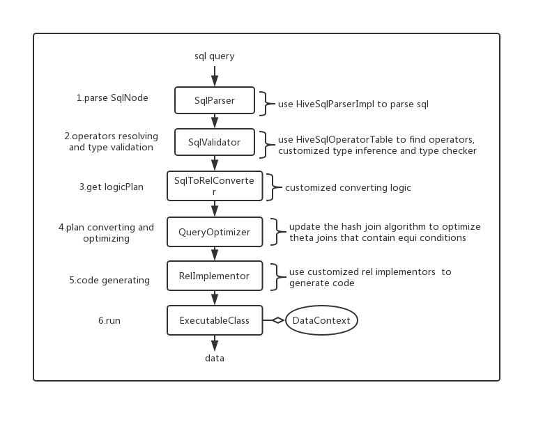

**Marble is a high performance in-memory hive sql engine based on [Apache Calcite](https://calcite.apache.org/).  
It can help you to migrate hive sql scripts to a real-time computing system.**

## Build and run tests
**Requirements**

* Java 1.8 as a build JDK
* Maven

1.build and install calcite-patch first
```$xslt
cd marble/calcite-patch
mvn clean install -DskipTests
```

2.build marble
```$xslt
cd marble
mvn clean install -DskipTests
```

3.import `marble` project into IDE, but **please don't import `calcite-patch` as a submodule of marble project**

4.run the test `TableEnvTest` and `HiveTableEnvTest`

## Usage
**Maven dependency**
```$xslt
todo
```
**API Overview**

```$xslt
TableEnv.enableSqlPlanCacheSize(200);

TableEnv tableEnv = HiveTableEnv.getTableEnv();

DataTable t1 = tableEnv.fromJavaPojoList(pojoList);
DataTable t2 = tableEnv.fromJdbcResultSet(resultSet);
DataTable t3=tableEnv.fromRowListWithSqlTypeMap(rowList,sqlTypeMap);

tableEnv.addSubSchema("test");
tableEnv.registerTable("test","t1",t1);
tableEnv.registerTable("test","t2", t2);
DataTable queryResult = tableEnv.sqlQuery("select * from test.t1 join test.t2 where t1.id=t2.id");
List<Map<String, Object>> rowList=queryResult.toMapList();
```
It's recommend to enable plan cache for same sql query:
```
TableEnv.enableSqlPlanCacheSize(200);
```

`TableEnv` is the main table api to execute sql queries on a dataSet.  
It can be used to:
* convert a java pojo List or jdbc ResultSet to a `DataTable`
* register a `DataTable` in TableEnv's catalog
* add subSchemas and customized functions in TableEnv's catalog
* execute a sql query to get the result `DataTable`

The `TableEnv` supports Calcite's sql dialect by default ,see it's [sql reference](https://calcite.apache.org/docs/reference.html).  
The target of `HiveTableEnv` is to support hive sql as far as possible，developers can  aslo use
a `TableConfig` to create a new TableEnv to support other sql dialects(MysqlTableEnv,PostgreTableEnv ..etc).


**Supported hive sql features**
* specific keywords and operators
* all of UDF,UDAF
* part of UDTF
* implicit type cast
* load customized UDF,UDAF by package name
  ```
  HiveTableEnv.registerHiveFunctionPackages("com.u51.data.hive.udf"); 
  ```
  
## Benchmark
There some benchmark tests in the  `benchmark` module,it compares flink,spark and marble on some simple
sql queries.
## Design
It shows how marble customized calcite in the sql processing flow:
  
You can find more details from calcite-patch's commit history.Now Marble uses calcite `1.18.0`.

## Roadmap
*  improve compatibility with hive sql.(high priority)
*  submit patches to Calcite,make it easy to upgrading calcite-core,
some related issues:[CALCITE-2282](https://issues.apache.org/jira/browse/CALCITE-2282),[CALCITE-2973](https://issues.apache.org/jira/browse/CALCITE-2973),[CALCITE-2992](https://issues.apache.org/jira/browse/CALCITE-2992).(high priority)
*  hive udf's constant folded.(low priority)
*  use a customized sql Planner to replace the default PlannerImpl.(low priority)
*  support TPC-DS query in a customized scale.(low priority)
*  distributed broadcast join.(experimental)
*  cost based optimizer.(experimental)

## Contributing
Welcome contributions.
Please use the Calcite-idea-code-style.xml under the marble directory to reformat code,
and ensure that the validation of maven checker-style plugin is success after source code building.

## License
This library is distributed under terms of Apache 2 License
